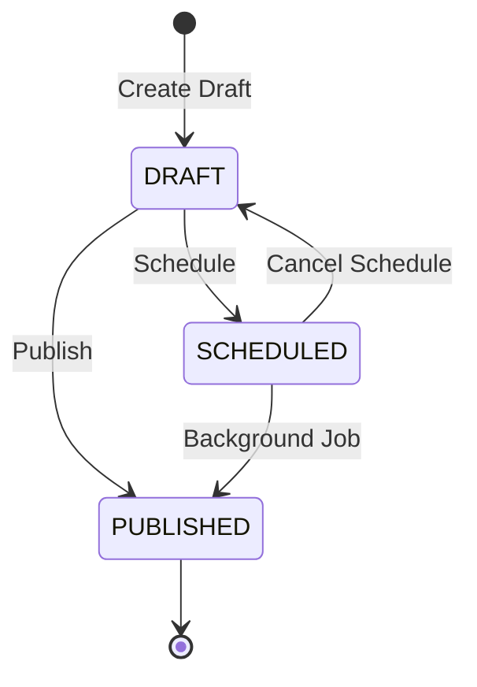

# Sociall Drafts Subsystem

The drafts subsystem handles the creation, scheduling, editing, and publishing of posts with a robust optimistic locking mechanism to prevent concurrent modification conflicts.

## Architecture

- **Controller**: purely HTTP layer.
- **Service**: Business logic and state machine (`DRAFT` -> `SCHEDULED` -> `PUBLISHED`).
- **Repository**: Prisma-backed data persistence.

## Optimistic Locking (Version Field & ETag)

To prevent users from overwriting each other's changes (e.g. from multiple devices), the API uses Optimistic Locking via a `version` field.

### Version Lifecycle
1. When a draft is created, its `version` is `1`.
2. The server responds with `ETag: "1"` (in the headers) and `"version": 1` in the JSON body.
3. Every mutation (`PUT`, `POST .../publish`, etc.) requires the client to send the current `version`.
4. The server increments the version automatically on a successful update. If the provided version does not match the database, a `409 Conflict` is returned.

### ETag Usage
- **Read**: `ETag: "2"`
- **Send**: `{ "version": 2, "caption": "Updated" }`
- **Receive**: `ETag: "3"`

### Conflict Resolution & Force Overwrite
If a conflict occurs, the client receives:
```json
{
  "success": false,
  "code": "DRAFT_CONFLICT",
  "message": "The draft has been updated since you last fetched it.",
  "requestId": "uuid",
  "timestamp": "iso-date"
}
```
The client can fetch the latest data, prompt the user, and if the user decides to overwrite, the client appends `?force=true` to the URL. This bypasses the version check but still increments the version.

```http
PUT /api/v1/drafts/draft-id-123?force=true
Content-Type: application/json

{
  "version": 1, 
  "caption": "I am overwriting whatever you wrote!"
}
```

## Pagination

The listing endpoint uses cursor-based pagination for high performance. The cursor is the `id` of the last seen draft.

```http
GET /api/v1/drafts?limit=10&cursor=d9b2d63d-a233-4123-8478-1a2b3c4d5e6f
```

## API Reference

### 1. List Drafts
**GET** `/api/v1/drafts`

*Response (200 OK)*
```json
{
  "success": true,
  "data": [
    {
      "id": "uuid",
      "caption": "My draft",
      "status": "DRAFT",
      "version": 1,
      "createdAt": "..."
    }
  ]
}
```

### 2. Get Draft by ID
**GET** `/api/v1/drafts/:id`

*Response (200 OK)*
```json
{
  "success": true,
  "data": {
    "id": "uuid",
    "caption": "My draft",
    "status": "DRAFT",
    "version": 1
  }
}
```

### 3. Create Draft
**POST** `/api/v1/drafts`
*Payload*
```json
{
  "caption": "New draft",
  "type": "POST"
}
```
*Response (201 Created)*
```json
{
  "success": true,
  "data": {
    "id": "uuid",
    "caption": "New draft",
    "version": 1
  }
}
```

### 4. Update Draft
**PUT** `/api/v1/drafts/:id`
*Payload*
```json
{
  "version": 1,
  "caption": "Updated text"
}
```
*Response (200 OK)*
```json
{
  "success": true,
  "data": {
    "id": "uuid",
    "version": 2
  }
}
```

### 5. Schedule Draft
**POST** `/api/v1/drafts/:id/schedule`
*Payload*
```json
{
  "version": 2,
  "scheduledAt": "2027-01-01T00:00:00.000Z"
}
```
*Response (200 OK)*
```json
{
  "success": true,
  "data": {
    "status": "SCHEDULED",
    "version": 3
  }
}
```

### 6. Cancel Schedule
**POST** `/api/v1/drafts/:id/cancel-schedule`
*Payload*
```json
{
  "version": 3
}
```
*Response (200 OK)*
```json
{
  "success": true,
  "data": {
    "status": "DRAFT",
    "version": 4
  }
}
```

### 7. Publish Draft
**POST** `/api/v1/drafts/:id/publish`
*Payload*
```json
{
  "version": 4
}
```
*Response (200 OK)*
```json
{
  "success": true,
  "data": {
    "status": "PUBLISHED",
    "version": 5
  }
}
```

### 8. Delete Draft
**DELETE** `/api/v1/drafts/:id`
*Response (200 OK)*
```json
{
  "success": true,
  "data": true
}
```

## State Transitions


## Error Codes
- `DRAFT_NOT_FOUND` (404): Draft doesn't exist or was soft-deleted.
- `DRAFT_CONFLICT` (409): Optimistic locking failure (version mismatch).
- `DRAFT_INVALID_STATE` (400): e.g. Trying to publish an already published draft.
- `FORBIDDEN` (403): User is attempting to modify someone else's draft.
